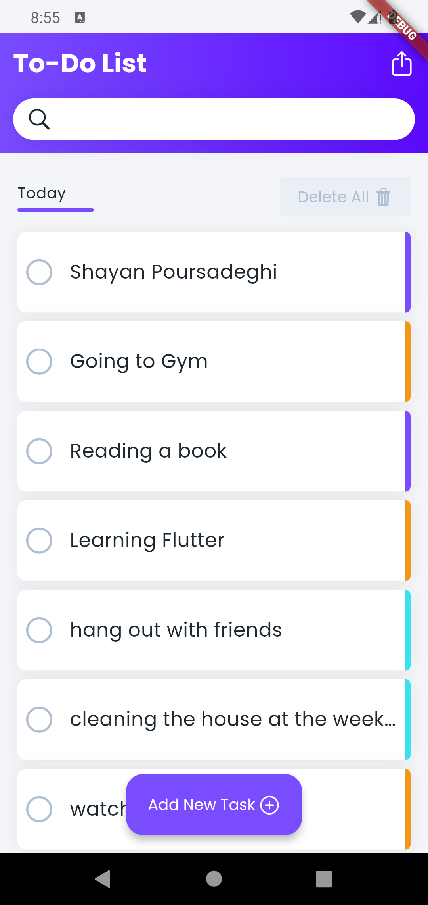
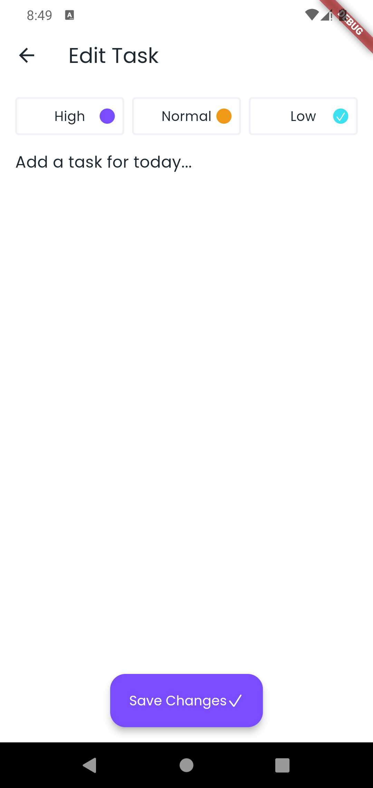
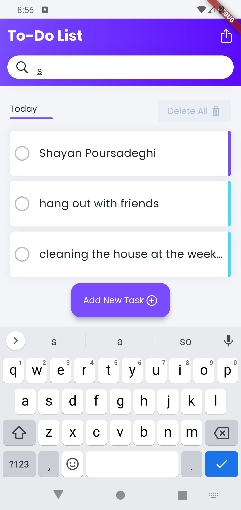

<h1>📋 Todo List App</h1>

This Todo List App is a Flutter application that allows users to create, edit, and manage their tasks with different priority levels efficiently. It also supports searching tasks, filtering based on input, deleting all tasks, and more. The app uses **Hive** for local storage of tasks and **BLoC** (Business Logic Component) and **Cubit** for state management. This is a great starter app for keeping track of your daily tasks!

<h2>📱 Features</H2>

- **Task Management**: Create, edit, and delete tasks.
- **Task Priority**: Assign priorities (Low, Normal, High) to tasks.
- **Task Search**: Search through tasks with a search bar.
- **Task Completion**: Mark tasks as completed or uncompleted.
- **State Management**: Uses **Bloc** and **Cubit** for managing states.
- **Persistent Storage**: Tasks are stored and fetched via a repository, and persisted locally using **Hive**, ensuring they are retained even after closing the app.
- **Friendly UI**: Smooth UI with a confirmation dialog before deleting a task. You can delete individual tasks or delete all tasks at once.


<h2>📂 Folder Structure</h2>
<pre>lib/
├── data/
│   ├── repo/
│   │   └── repository.dart     # Handles repository logic for tasks
│   ├── source/
│   │   ├── hive_task_source.dart  # Handles Hive data source operations
│   │   ├── source.dart            # Abstract DataSource class for CRUD operations
│   ├── data.dart                # Task and Priority entity definitions
│   ├── data.g.dart              # Auto-generated Hive adapters
│
├── screens/
│   ├── edit/
│   │   ├── edit.dart            # Screen for creating or editing tasks
│   │   ├── cubit/
│   │   │   ├── edit_task_cubit.dart      # Cubit for editing task states
│   │   │   ├── edit_task_state.dart      # States for EditTaskCubit   
│   ├── home/
│   │   ├── home.dart            # Main screen with task list, search, and delete functionality
│   │   ├── bloc/
│   │   │   ├── task_list_bloc.dart  # BLoC for managing state of tasks
│   │   │   ├── task_list_event.dart # BLoC events (Task creation, deletion, search)
│   │   │   └── task_list_state.dart # BLoC states (Success, Error, Empty, Loading)
│
├── main.dart                    # Entry point for the Flutter app
├── widgets.dart                 # Custom UI widgets such as TaskItem, EmptyState, etc.
</pre>

<h2>🚀 Getting Started</h2>
<h3>Prerequisites</h3>
To run the project, ensure you have the following installed:

- [Flutter SDK](https://docs.flutter.dev/get-started/install)
- [Dart SDK](https://dart.dev/get-dart)
- [Hive](https://pub.dev/packages/hive_flutter/install) (for local storage)
- [Provider](https://pub.dev/packages/provider/install) (for dependency injection)
- [BLoC](https://pub.dev/packages/flutter_bloc/install) (for state management)      (It contains both Cubit and Bloc instances)

<h3>Installation</h3>
1. Clone the repository:

```bash
git clone https://github.com/ShayanPoursadeghi/Todo-List.git
cd Todo-List 
```
    
2. Install the dependencies:

```bash
flutter pub get
```

3. Set up Hive for the project:

```bash
flutter packages pub run build_runner build
```

4. Run the app:

```bash
flutter run
```

<h2>🛠 Technologies Used</h2>

- **Flutter**: For building the UI and handling app logic.
- **Hive**: Lightweight and fast NoSQL database used for storing tasks locally.
- **BLoC (Business Logic Component)**: For managing state and logic in a clear, scalable way.
- **Provider**: For dependency injection, helping manage state across the app.
- **Google Fonts**: For custom typography in the app.

<h2>🧩 BLoC Architecture Overview</h2>

This project follows the **BLoC** architecture pattern to separate business logic from the UI layer. Here's how the BLoC structure works:
- **Events**: Users' actions (e.g., searching for tasks, deleting tasks) are turned into events like <code>TaskListSearch</code> and <code>TaskListDeleteAll</code>.
- **States**: The app reacts to events by emitting new states such as <code>TaskListLoading</code>, <code>TaskListSuccess</code>, <code>TaskListEmpty</code>, etc.
- **BLoC (task_list_bloc.dart)**: Contains all the logic that reacts to events and emits states. It works as the "middle-man" between the UI and the data source.

<h2>🗃️ Hive Integration</h2>

The app uses **Hive** for storing tasks locally in a fast, key-value store. The following entities are stored in Hive:
- **TaskEntity**: Each task that the user creates is stored with an ID, name, priority, and completed status.
- **Priority**: Represents the priority of the task (low, normal, or high).

<h2>💡 Features Breakdown</h2>

<h3>Adding a Task</h3>
You can add new tasks by clicking the <code>Add New Task</code> button. Tasks are saved with a priority and name, and they persist in the local storage using Hive.

<h3>Searching for Tasks</h3>

The search bar allows users to filter tasks by typing in keywords. The app uses **BLoC** to handle the search and update the UI with the filtered tasks.

<h3>Deleting Tasks</h3>
To delete a task, long-press the task item. The app will ask for confirmation before permanently removing it from the list.

<h3>Marking Tasks as Complete</h3>
By clicking the checkbox next to each task, the user can toggle the completion status of a task. The state of the task is immediately saved in Hive and reflected in the UI.

<h2>🖼️ Screenshots</h2>

&nbsp;&nbsp;&nbsp;&nbsp;&nbsp;&nbsp;&nbsp;&nbsp;&nbsp;&nbsp;&nbsp;&nbsp;&nbsp;&nbsp;&nbsp;&nbsp;&nbsp;&nbsp;&nbsp;&nbsp;&nbsp;&nbsp;&nbsp; **Home Screen**

  

  
&nbsp;&nbsp;&nbsp;&nbsp;&nbsp;&nbsp;&nbsp;&nbsp;&nbsp;&nbsp;&nbsp;&nbsp;&nbsp;&nbsp;&nbsp;&nbsp; **Add/Edit Task Screen**  
  

  
&nbsp;&nbsp;&nbsp;&nbsp;&nbsp;&nbsp;&nbsp;&nbsp;&nbsp;&nbsp;&nbsp;&nbsp;&nbsp;&nbsp; **Filtering tasks by search**         



<h2>👨‍💻 Contributing</h2>

We welcome contributions to this project! If you want to contribute:

1. Fork the repository.
2. Create a new branch.
3. Make your changes and test them.
4. Submit a pull request for review.

<h2>📄 License</h2>

This project is licensed under the MIT License - see the [License](https://opensource.org/license/mit) file for details. 

<h2>📧 Contact</h2>

Feel free to reach out if you have any questions or suggestions:

- **Email**: [sh.psadeghi@gmail.com](mailto:sh.psadeghi@gmail.com). 

